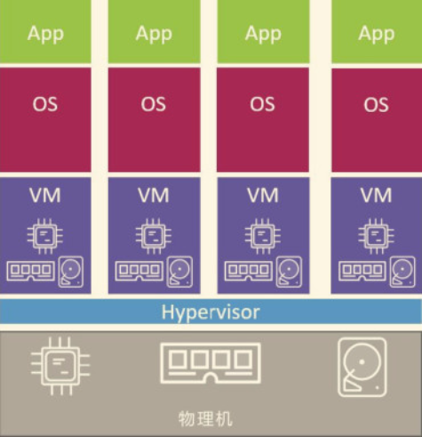
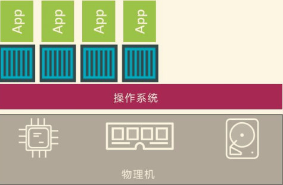
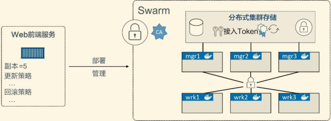
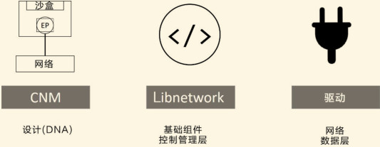
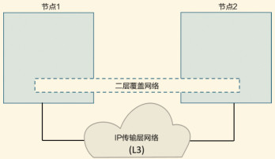
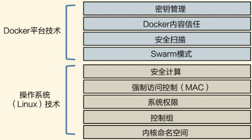
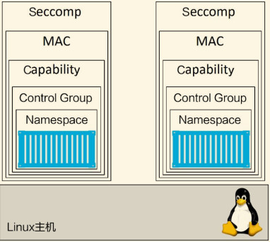

### 引擎

Docker由以下主要组件组成：Docker客户端（Docker Client）、Docker守护进程（Docker Daemon）、containerd以及runc。他们共同负责容器的创建和运行。

Docker daemon是单一的二进制文件，包含诸如Docker客户端、Docker API、容器运行时、镜像构建等。

### 容器

容器和虚拟机的区别

***虚拟机***：在虚拟机模型中，首先要开启物理机并启动Hypervisor引导程序。一旦Hypervisor启动，就会占有机器上的全部物理资源，如CPU、RAM、存储和NIC。Hypervisor接下来就会将这些物理资源划分为虚拟资源，并且看起来与真实物理资源完全一致。然后Hypervisor会将这些资源打包进一个叫作虚拟机（VM）的软件结构当中。这样用户就可以使用这些虚拟机，并在其中安装操作系统和应用。
     

***容器***：服务器启动之后，所选择的操作系统会启动。在Docker世界中可以选择Linux，或者内核支持内核中的容器原语的新版本Windows。与虚拟机模型相同，OS也占用了全部硬件资源。在OS层之上，需要安装容器引擎（如Docker）。容器引擎可以获取系统资源 ，比如进程树、文件系统以及网络栈，接着将资源分割为安全的互相隔离的资源结构，称之为容器。每个容器看起来就像一个真实的操作系统，在其内部可以运行应用。

  

从更高层面上来讲，Hypervisor是硬件虚拟化（Hardware Virtualization）——Hypervisor将硬件物理资源划分为虚拟资源；另外，容器是操作系统虚拟化（OS Virtualization） ——容器将系统资源划分为虚拟资源。

通常建议在运行容器时配置好重启策略。这是容器的一种自我修复能力，可以在指定事件或者错误后重启来完成自我修复。

#### 生产环境中的多阶段构建

多阶段构建方式使用一个Dockerfile，其中包含多个FROM 指令。每一个FROM指令都是一个新的构建阶段（Build Stage） ，并且可以方便地复制之前阶段的构件。

> 一旦有指令在缓存中未命中（没有该指令对应的镜像层），则后续的整个构建过程将不再使用缓存。在编写Dockerfile时须特别注意这一点，尽量将易于发生变化的指令置于Dockerfile文件的后方执行。这意味着缓存未命中的情况将直到构建的后期才会出现——从而构建过程能够尽量从缓存中获益。

### Docker Compose

Docker Compose的前身是Fig。Fig是一个由Orchard公司开发的强有力的工具，在当时是进行多容器管理的最佳方案。Fig是一个基于Docker的Python工具，允许用户基于一个YAML文件定义多容器应用，从而可以使用fig 命令行工具进行应用的部署。Fig还可以对应用的全生命周期进行管理。内部实现上，Fig会解析YAML文件，并通过Docker API进行应用的部署和管理。这种方式相当不错！

Docker Compose使用YAML文件来定义多服务的应用。YAML是JSON的一个子集，因此也可以使用JSON。

docker-compose up 命令用于部署一个Compose应用。

docker-compose stop 命令会停止Compose应用相关的所有容器，但不会删除它们。

docker-compose rm 命令用于删除已停止的Compose应用。它会删除容器和网络，但是不会删除卷和镜像。

docker-compose restart 命令会重启已停止的Compose应用。

### Docker Swarm

集群角度来说，一个Swarm由一个或多个Docker节点组成。这些节点可以是物理服务器、虚拟机、树莓派（Raspberry Pi）或云实例。唯一的前提就是要求所有节点通过可靠的网络相连。

节点会被配置为管理节点（Manager）或工作节点（Worker）。管理节点负责集群控制面（Control Plane），进行诸如监控集群状态、分发任务至工作节点等操作。工作节点接收来自管理节点的任务并执行。

Swarm的配置和状态信息保存在一套位于所有管理节点上的分布式etcd数据库中。该数据库运行于内存中，并保持数据的最新状态。关于该数据库最棒的是，它几乎不需要任何配置——作为Swarm的一部分被安装，无须管理

Swarm使用TLS进行通信加密、节点认证和角色授权。自动密钥轮换（Automatic Key Rotation）更是锦上添花！其在后台默默进行，用户甚至感知不到这一功能的存在！

关于应用编排，Swarm中的最小调度单元是服务。它是随Swarm引入的，在API中是一个新的对象元素，它基于容器封装了一些高级特性，是一个更高层次的概念。

当容器被封装在一个服务中时，我们称之为一个任务或一个副本，服务中增加了诸如扩缩容、滚动升级以及简单回滚等特性。

##### 搭建集群

在单引擎模式下的Docker主机上运行docker swarm init 会将其切换到Swarm模式，并创建一个新的Swarm，将自身设置为Swarm的第一个管理节点。

更多的节点可以作为管理节点或工作节点加入进来。这一操作也会将新加入的节点切换为 Swarm模式。

Swarm模式下的操作默认运行于2337端口。虽然它是可配置的，但2377/tcp是用于客户端与Swarm进行安全（HTTPS）通信的约定俗成的端口配置。

Swarm的管理节点内置有对HA的支持。这意味着，即使一个或多个节点发生故障，剩余管理节点也会继续保证Swarm的运转。从技术上来说，Swarm实现了一种主从方式的多管理节点的HA。这意味着，即使你可能——并且应该——有多个管理节点，也总是仅有一个节点处于活动状态。通常处于活动状态的管理节点被称为“主节点”（leader），而主节点也是唯一一个会对Swarm发送控制命令的节点。

Swarm使用了Raft共识算法的一种具体实现来支持管理节点的HA。关于HA，以下是两条最佳实践原则。

- 部署奇数个管理节点。
- 不要部署太多管理节点（建议3个或5个）。

部署奇数个管理节点有利于减少脑裂（Split-Brain）情况的出现机会。对于所有的共识算法来说，更多的参与节点就意味着需要花费更多的时间来达成共识。

Swarm集群内置有繁多的安全机制，并提供了开箱即用的合理的默认配置——如CA设置、接入Token、公用TLS、加密集群存储、加密网络、加密节点ID等。

##### Swarm服务

使用服务仍能够配置大多数熟悉的容器属性，比如容器名、端口映射、接入网络和镜像。此外还增加了额外的特性，比如可以声明应用服务的期望状态，将其告知Docker后，Docker会负责进行服务的部署和管理。

使用docker service create 命令创建一个新的服务。Swarm 会在后台进行轮训检查（Reconciliation Loop），来持续比较服务的实际状态和期望状态是否一致。如果一致，则皆大欢喜，无须任何额外操作；如果不一致，Swarm会使其一致。

使用docker service ls 命令可以查看Swarm中所有运行中的服务。

服务的默认复制模式（Replication Mode）是副本模式（replicated ）。这种模式会部署期望数量的服务副本，并尽可能均匀地将各个副本分布在整个集群中。

另一种模式是全局模式（global ），在这种模式下，每个节点上仅运行一个副本。

docker service create 命令传递--mode global 参数部署一个全局服务。

docker service scale 命令即可对服务进行扩容。

docker service rm 命令可用于删除之前部署的服务。

docker service update 命令用于对运行中的服务的属性进行变更。

docker service logs 命令用于查看服务的日志。

### Docker网络

在顶层设计中，Docker网络架构由3个主要部分构成：CNM、Libnetwork和驱动。

CNM是设计标准。在CNM中，规定了Docker网络架构的基础组成要素。

Libnetwork是CNM的具体实现，并且被Docker采用。Libnetwork通过Go语言编写，并实现了CNM中列举的核心组件。

驱动通过实现特定网络拓扑的方式来拓展该模型的能力。

#### CNM

CNM定义了3个基本要素：沙盒（Sandbox）、终端（Endpoint）和网络（Network）

- [ ] ***沙盒***是一个独立的网络栈。其中包括以太网接口、端口、路由表以及DNS配置。
- [ ] ***终端***就是虚拟网络接口。就像普通网络接口一样，终端主要职责是负责创建连接。在CNM中，终端负责将沙盒连接到网络。
- [ ] ***网络***是802.1d网桥（类似大家熟知的交换机）的软件实现。因此，网络就是需要交互的终端的集合，并且终端之间相互独立。

#### Libnetwork

CNM是设计规范文档，Libnetwork是标准的实现。Libnetwork是开源的，采用Go语言编写，它跨平台（Linux以及Windows），并且被Docker所使用。

Libnetwork实现了CNM中定义的全部3个组件。此外它还实现了本地服务发现（Service Discovery）、基于Ingress的容器负载均衡，以及网络控制层和管理层功能。

#### 驱动

如果说Libnetwork实现了控制层和管理层功能，那么驱动就负责实现数据层

#### 单机桥接网络

- ***单机***意味着该网络只能在单个Docker主机上运行，并且只能与所在Docker主机上的容器进行连接
- ***桥接***意味着这是802.1.d桥接的一种实现（二层交换机）。

Linux Docker创建单机桥接网络采用内置的桥接驱动，而Windows Docker创建时使用内置的NAT驱动。实际上，这两种驱动工作起来毫无差异。

#### 服务发现

服务发现（Service Discovery） 允许容器和Swarm服务通过名称互相定位。唯一的要求就是需要处于同一个网络当中。其底层实现是利用了Docker内置的DNS服务器，为每个容器提供DNS解析功能。

##### Ingress网络

Swarm支持两种服务发布模式，两种模式均保证服务从集群外可访问。

- Ingress模式（默认）：通过Ingress模式发布的服务，可以保证从Swarm集群内任一节点（即使没有运行服务的副本）都能访问该服务；
- Host模式：以Host模式发布的服务只能通过运行服务副本的节点来访问

在底层，Ingress模式采用名为Service Mesh 或者Swarm Mode Service Mesh的四层路由网络来实现。

docker network ls 用于列出运行在本地Docker主机上的全部网络。

docker network create 创建新的Docker网络。

docker network inspect 提供Docker网络的详细配置信息。

docker network prune 删除Docker主机上全部未使用的网络。

docker network rm 删除Docker主机上指定网络。

### Docker覆盖网络

#### 在Swarm模式下构建并测试Docker覆盖网络

##### 构建Swarm

首先需要将两台主机配置为包含两个节点的Swarm集群。接下来会在node1节点上运行docker swarm init 命令使其成为管理节点，然后在node2节点上运行docker swarm join 命令来使其成为工作节点。

##### 创建新的覆盖网络

docker network create -d overlay 创建了一个崭新的覆盖网络，能连接Swarm集群内的所有主机，并且该网络还包括一个TLS加密的控制层！如果还想对数据层加密的话，只需在命令中增加-o encrypted 参数。

##### 将服务连接到覆盖网络

docker service create 连接到了覆盖网络，并且还基于指定的镜像创建了两个副本（容器）。

#### 覆盖网络工作原理

#####　VXLAN
Docker使用VXLAN隧道技术创建了虚拟二层覆盖网络。在VXLAN的设计中，允许用户基于已经存在的三层网络结构创建虚拟的二层网络。

VXLAN的美妙之处在于它是一种封装技术，能使现存的路由器和网络架构看起来就像普通的IP/UDP包一样，并且处理起来毫无问题。为了创建二层覆盖网络，VXLAN基于现有的三层IP网络创建了隧道。

VXLAN隧道两端都是VXLAN隧道终端（VXLAN Tunnel Endpoint, VTEP）。VTEP完成了封装和解压的步骤，以及一些功能实现所必需的操作

docker network create 是创建新网络所使用的命令。

docker network ls 用于列出Docker主机上全部可见的容器网络。

docker network inspect 用于查看特定容器网络的详情。

docker network rm 删除指定网络。

### 卷与持久化数据

如果希望自己的容器数据保留下来（持久化），则需要将数据存储在卷上。卷与容器是解耦的，从而可以独立地创建并管理卷，并且卷并未与任意容器生命周期绑定。最终效果即用户可以删除一个关联了卷的容器，但是卷并不会被删除。

#### 容器与非持久数据

容器擅长无状态和非持久化事务。每个容器都被自动分配了本地存储。默认情况下，这是容器全部文件和文件系统保存的地方。

默认情况下，容器的所有存储都使用本地存储。所以默认情况下容器全部目录都是用该存储。

#### 容器与持久化数据

在容器中持久化数据的方式推荐采用卷。总体来说，用户创建卷，然后创建容器，接着将卷挂载到容器上。卷会挂载到容器文件系统的某个目录之下，任何写到该目录下的内容都会写到卷中。即使容器被删除，卷与其上面的数据仍然存在。

Docker中卷属于一等公民。抛开其他原因，这意味着卷在API中拥有一席之地，并且有独立的docker volume 子命令。

#### 在集群节点间共享存储

Docker能够集成外部存储系统，使得集群间节点共享外部存储数据变得简单。例如，独立存储LUN或者NFS共享可以应用到多个Docker主机，因此无论容器或者服务副本运行在哪个节点上，都可以共享该存储。

不过这种配置需要关注数据损坏问题

docker volume create 命令用于创建新卷。

docker volume ls 会列出本地Docker主机上的全部卷。

docker volume inspect 用于查看卷的详细信息。

docker volume prune 会删除未被容器或者服务副本使用的全部卷。

docker volume rm 删除未被使用的指定卷。

### Docker Stack

如果了解Docker Compose，就会发现Docker Stack非常简单。事实上在许多方面，Stack一直是期望的Compose——完全集成到Docker中，并能够管理应用的整个生命周期。

从体系结构上来讲，Stack位于Docker应用层级的最顶端。Stack基于服务进行构建，而服务又基于容器

默认情况下，覆盖网络的所有控制层都是加密的。如果需要加密数据层，有两种选择

- 在docker network create 命令中指定-o encrypted 参数。
- 在Stack文件中的driver_opts 之下指定encrypted:'yes' 。

数据层加密会导致额外开销，而影响额外开销大小的因素有很多，比如流量的类型和流量的多少。但是，通常额外开销会在10%的范围之内。

Stack是一组相关联的服务和基础设施，需要进行统一的部署和管理。Stack是由普通的Docker资源构建而来：网络、卷、密钥、服务等。这意味着可以通过普通的Docker命令对其进行查看和重新配置

所有应用/Stack都应采用该方式进行更新。所有的变更都应该通过Stack文件进行声明，然后通过 docker stack deploy 进行部署 。

docker stsack deploy 用于根据Stack文件（通常是docker-stack.yml ）部署和更新Stack服务的命令

docker stack ls 会列出Swarm集群中的全部Stack，包括每个Stack拥有多少服务。

docker stack ps 列出某个已经部署的Stack相关详情。

docker stack rm 命令用于从Swarm集群中移除Stack。

### Docker安全

安全本质就是分层！通俗地讲，拥有更多的安全层，就能拥有更多的安全性。而Docker提供了很多安全层。

Docker的原生安全技术：

- ***Docker Swarm模式：***默认是开启安全功能的。无须任何配置，就可以获得加密节点ID、双向认证、自动化CA配置、自动证书更新、加密集群存储、加密网络等安全功能。
- ***Docker内容信任（Docker Content Trust, DCT）：***允许用户对镜像签名，并且对拉取的镜像的完整度和发布者进行验证。
- ***Docker安全扫描（Docker Security Scanning）：***分析Docker镜像，检查已知缺陷，并提供对应的详细报告。
- ***Docker密钥：***使安全成为Docker生态系统中重要的一环。Docker密钥存储在加密集群存储中，在容器传输过程中实时解密，使用时保存在内存文件系统，并运行了一个最小权限模型。

#### Linux安全技术

每个优秀的容器平台都应该使用命名空间和控制组技术来构建容器。最佳的容器平台还会集成其他容器安全技术，例如系统权限、强制访问控制系统（如SELinux和AppArmor）以及安全计算。

##### Namespace

内核命名空间属于容器中非常核心的一部分！ 该技术能够将操作系统（OS）进行拆分，使一个操作系统看起来像多个互相独立的操作系统一样。

###### Docker容器是由各种命名空间组合而成的 。Docker容器本质就是命名空间的有组织集合 。

Docker是如何使用每个命名空间:

- 进程ID命名空间：Docker使用PID 命名空间为每个容器提供互相独立的容器树。每个容器都拥有自己的进程树，意味着每个容器都有自己的PID为1的进程。PID命名空间也意味着容器不能看到其他容器的进程树，或者其所在主机的进程树。
- 网络命名空间：Docker使用NET 命名空间为每个容器提供互相隔离的网络栈。网络栈中包括接口、ID地址、端口地址以及路由表。例如，每个容器都有自己的eth0网络接口，并且有自己独立的IP和端口地址。
- 挂载点命名空间：每个容器都有互相隔离的根目录/ 。这意味着每个容器都有自己的/etc 、/var 、/dev 等目录。容器内的进程不能访问Linux主机上的目录，或者其他容器的目录，只能访问自己容器的独立挂载命名空间。进程内通信命名空间：Docker使用IPC 命名空间在容器内提供共享内存。IPC 提供的共享内存在不同容器间也是互相独立的。
- 用户命名空间：Docker允许用户使用USER 命名空间将容器内用户映射到Linux主机不同的用户上。常见的例子就是将容器内的root 用户映射到Linux主机的非root用户上。用户命名空间对于Docker来说还属于新生事物且非必选项。该部分内容在未来可能出现改变。
- TS命名空间：Docker使用UTS 命名空间为每个容器提供自己的主机名称。

##### Control Group

如果说命名空间用于隔离，那么控制组就是用于限额。

##### Capability

在底层，Linux root用户是由许多能力组成的。其中一部分包括以下几点。

- CAP_CHOWN ：允许用户修改文件所有权。
- CAP_NET_BIND_SERVICE ：允许用户将socket绑定到系统端口号。
- CAP_SETUID ：允许用户提升进程优先级。
- CAP_SYS_BOOT ：允许用户重启系统。

Docker采用Capability机制来实现用户在以root身份运行容器的同时，还能移除非必须的root能力。如果容器运行只需要root的绑定系统网络端口号的能力，则用户可以在启动容器的同时移除全部root能力，然后再将CAP_NET_BIND_SERVICE能力添加回来。

##### MAC

Docker采用主流Linux MAC技术，例如AppArmor以及SELinux。

Docker允许用户在启动容器的时候不设置相应策略，还允许用户根据需求自己配置合适的策略。

##### Seccomp

Docker使用过滤模式下的Seccomp来限制容器对宿主机内核发起的系统调用。

用户同样可以自定义Seccomp配置，同时也可以通过向Docker传递指定参数，使Docker启动时不设置任何Seccomp配置。

Docker基本支持所有的Linux重要安全技术，同时对其进行封装并赋予合理的默认值，这在保证了安全的同时也避免了过多的限制

#### Docker平台安全技术

##### Swarm模式

Swarm模式支持用户集群化管理多个Docker主机，同时还能通过声明式的方式部署应用。每个Swarm都由管理者和工作者节点构成，节点可以是Linux或者Windows。管理者节点构成了集群中的控制层，并负责集群配置以及工作负载的分配。工作者节点就是运行应用代码的容器。

Swarm安全特性包括以下几点：

- 加密节点ID。
- 基于TLS的认证机制。
- 安全准入令牌。
- 支持周期性证书自动更新的CA配置。
- 加密集群存储（配置DB）。
- 加密网络。

##### Docker安全扫描

Docker安全扫描对Docker镜像进行二进制代码级别的扫描，对其中的软件根据已知缺陷数据库（CVE数据库）进行检查。在扫描执行完成后，会生成一份详细报告。

##### Docker内容信任

Dockr内容信任（Docker Content Trust，DCT）使得用户很容易就能确认所下载镜像的完整性以及其发布者。在不可信任的网络环境中下载镜像时，这一点很重要。

##### Docker密钥

Docker将密钥变成Docker生态系统中的一等公民。

