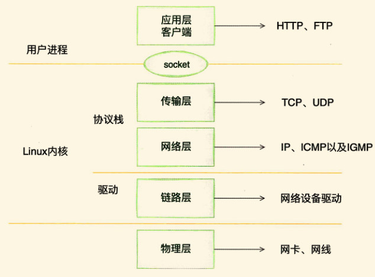

### 内核是如何接收网络包的

1、相关实际问题

1. RingBuffer是什么，RingBuffer为什么会丢包
2. 络相关的硬中断，软中断都是什么？
3. Linux⾥的ksoftirgd內核线程是⼲什么的？
4. 为什么⽹卡开启多队列能提升⽹络性能？
5.  tcpdump是如何⼯作的？
6. ptable/netfiter是在哪⼀层实现的？
7. cpdump能否抓到被iptable封禁的包？
8. ⽹络接收过程中的CPU开销如何查看？
9. DPDK是什么神器？

以Linux的视角看到的TCP/IP网络分层模型如下图：

内核和网络设备驱动是通过中断的方式来处里的。当设备上有数据到达时，会给CPU的相关引脚出发一个电压变化，以通知CPU来处理数据。对于网络模块来说，由于处理的过程复杂且耗时，如果在中断函数中完成所有处理，将会导致中断函数过度占用CPU，使得CPU无法响应其他设备，例如鼠标和键盘的消息。因此Linux中断处理函数是分上半部分和下半部分的。上半部分只进行最简单的工作，快速处理之后释放CPU，接着CPU就可以允许其他中断进来。将剩下的绝大部分工作都放到下半部，可以慢慢、从容处理。

以下是内核收包示意图：

